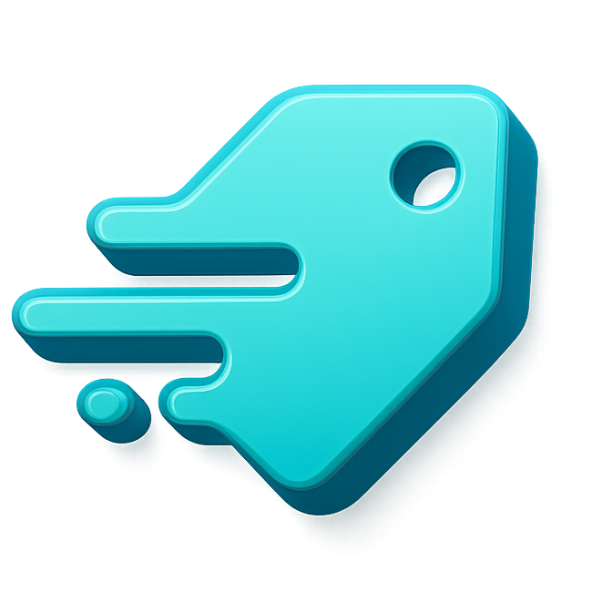

<p align="center">
  
</p>

<h1 align="center">TagFusion</h1>

<p align="center">
  <strong>Professionelles Bild-Tagging und Metadaten-Management für Windows</strong>
</p>

<p align="center">
  
  
  
  
  
</p>

---

**TagFusion** ist ein modernes, natives Windows-Tool zur professionellen Bild-Verwaltung und -Verschlagwortung. Tags werden direkt in die Bild-Metadaten geschrieben (EXIF/IPTC/XMP) — portabel, standardkonform und kompatibel mit Adobe Lightroom, Bridge, Photoshop und dem Windows Explorer.

---

## Features

### Bildverwaltung
- **3-Spalten-Layout** — Vertraute Explorer-Ansicht mit Ordnerbaum, Bildraster und Tag-Panel
- **Sortierung** — Nach Name, Datum, Größe oder Bewertung
- **Zoom-Steuerung** — Flexible Thumbnail-Größe (50% – 200%)
- **Lightbox** — Vollbildansicht für detaillierte Betrachtung
- **Ordner-Navigation** — Lokale Laufwerke und NAS-Systeme durchsuchen

### Tagging-System
- **Metadaten-konform** — Schreibt in XMP, IPTC und Windows System.Keywords via ExifTool
- **Hierarchische Tag-Bibliothek** — Kategorien, Unterkategorien und Tags mit Drag & Drop
- **Batch-Tagging** — Mehrere Bilder gleichzeitig taggen
- **5-Sterne-Bewertung** — Bewertungen direkt in Bild-Metadaten speichern

### Datei-Operationen
- **Kontextmenü** — Rechtsklick für Kopieren, Ausschneiden, Einfügen, Umbenennen, Löschen
- **Im Explorer öffnen** — Schnellzugriff auf den Dateispeicherort
- **Eigenschaften** — Detaillierte Dateiinformationen inkl. Bildmaße

### UI / UX
- **Glasmorphismus-Design** — Premium-Look mit Transparenz-Effekten und Cyan-Akzent
- **Dark Mode** — Augenfreundlich für lange Sessions
- **Animationen** — Flüssige Übergänge mit Framer Motion
- **Mehrsprachig** — Deutsch und Englisch (i18n)

### Tastaturkürzel

| Kürzel | Aktion |
|--------|--------|
| `Strg+A` | Alle auswählen |
| `Strg+C` / `Strg+X` / `Strg+V` | Kopieren / Ausschneiden / Einfügen |
| `F2` | Umbenennen |
| `Del` | Löschen |
| `Alt+Enter` | Eigenschaften |
| `Escape` | Auswahl aufheben |
| `Strg+` / `Strg-` / `Strg+0` | Zoom: Vergrößern / Verkleinern / Zurücksetzen |

---

## Architektur

TagFusion verwendet eine hybride Architektur — ein .NET 8 WPF-Host mit eingebettetem WebView2 (Chromium), der ein React-Frontend rendert:

```
┌──────────────────────────────────────────────────────┐
│                   TagFusion.exe                       │
│                                                       │
│   ┌───────────────────────────────────────────────┐  │
│   │            WebView2 (Chromium)                │  │
│   │   ┌───────────────────────────────────────┐   │  │
│   │   │     React + TypeScript + Tailwind     │   │  │
│   │   │     Zustand · Framer Motion · i18n    │   │  │
│   │   └───────────────────────────────────────┘   │  │
│   └───────────────────────────────────────────────┘  │
│                       ↕ Bridge (JSON)                 │
│   ┌───────────────────────────────────────────────┐  │
│   │          C# Backend Services (.NET 8)         │  │
│   │                                               │  │
│   │  ExifToolService     FileSystemService        │  │
│   │  ThumbnailService    TagService               │  │
│   │  DatabaseService     ImageEditService         │  │
│   │  FileOperationService                         │  │
│   └───────────────────────────────────────────────┘  │
│                       ↕                               │
│   ┌───────────────────────────────────────────────┐  │
│   │  SQLite Cache  ·  ExifTool  ·  Dateisystem    │  │
│   └───────────────────────────────────────────────┘  │
└──────────────────────────────────────────────────────┘
```

**Datenfluss:** UI-Interaktion → Zustand Store → Bridge Service → C# Backend → Dateisystem/Metadaten → JSON Response → UI-Update

---

## Technologie-Stack

### Backend

| Technologie | Version | Zweck |
|---|---|---|
| .NET | 8.0 | Framework |
| WPF | — | Windows UI Host |
| WebView2 | 1.0.2592.51 | Chromium Browser Control |
| SQLite | 1.0.118 | Thumbnail-Cache & Datenbank |
| System.Drawing.Common | 8.0.0 | Bildverarbeitung |
| DI + Logging | MS.Extensions | Dependency Injection & Logging |

### Frontend

| Technologie | Version | Zweck |
|---|---|---|
| React | 18.2.0 | UI Framework |
| TypeScript | 5.3.0 | Typsicherheit |
| Vite | 5.0.0 | Build Tool & Dev Server |
| TailwindCSS | 3.4.0 | Utility-First Styling |
| HeroUI | 2.8.5 | UI-Komponentenbibliothek |
| Framer Motion | 12.23.25 | Animationen |
| Zustand | 4.4.7 | State Management |
| i18next | 25.8.0 | Internationalisierung |
| Lucide React | 0.292.0 | Icons |
| React Virtuoso | 4.18.1 | Virtualisierte Listen |

### Testing

| Tool | Bereich |
|---|---|
| Vitest | Frontend Unit/Component Tests |
| Playwright | Frontend E2E Tests |
| NUnit + FsCheck + Moq | Backend Unit/Integration Tests |

---

## Installation & Entwicklung

### Voraussetzungen

- **Windows 10/11** (64-bit)
- **.NET 8 SDK** — [Download](https://dotnet.microsoft.com/download/dotnet/8.0)
- **Node.js 18+** — [Download](https://nodejs.org/)
- **WebView2 Runtime** — Auf Windows 10/11 meist vorinstalliert

### Development Setup

**1. Repository klonen**
```bash
git clone <repository-url>
cd TagFusion
```

**2. Frontend starten** (Terminal 1)
```bash
cd Frontend
npm install
npm run dev
```
Das Frontend läuft auf `http://localhost:5173`

**3. Backend starten** (Terminal 2)
```bash
cd Backend/TagFusion
dotnet run
```
Das Backend öffnet ein Fenster und lädt das Frontend aus dem Vite Dev Server.

### Tests ausführen

```bash
# Frontend
cd Frontend
npm run test                # Vitest (Watch-Modus)
npm run test:coverage       # Mit Coverage-Report
npm run test:e2e            # Playwright E2E (headless)

# Backend
cd Backend
dotnet test TagFusion.sln   # Alle NUnit Tests
```

### Production Build

```powershell
./build_release.ps1
```

Das Script:
1. Baut das Frontend (`npm run build`)
2. Kopiert das Ergebnis nach `Backend/TagFusion/wwwroot/`
3. Publiziert das Backend als eigenständige Windows-EXE

**Ausgabe:** `Backend/TagFusion/bin/Release/net8.0-windows/win-x64/publish/TagFusion.exe`

> **Wichtig:** Der `wwwroot/`-Ordner muss sich im selben Verzeichnis wie die EXE befinden.

---

## Projektstruktur

```
TagFusion/
├── Backend/
│   ├── TagFusion/
│   │   ├── Bridge/           # WebView2 ↔ React IPC
│   │   ├── Database/         # SQLite Datenbank-Interface
│   │   ├── Models/           # Datenmodelle (ImageFile, Tag, etc.)
│   │   ├── Services/         # Business Logic (7 Services)
│   │   ├── wwwroot/          # Kompiliertes Frontend (Produktion)
│   │   └── MainWindow.xaml   # WPF Host + WebView2
│   ├── TagFusion.Tests/      # NUnit Backend-Tests
│   └── TagFusion.sln
├── Frontend/
│   ├── src/
│   │   ├── components/       # React-Komponenten (nach Feature)
│   │   ├── hooks/            # Custom React Hooks
│   │   ├── services/         # Bridge Client (C# Kommunikation)
│   │   ├── stores/           # Zustand State Management
│   │   ├── types/            # Shared TypeScript Interfaces
│   │   ├── styles/           # CSS & Animationen
│   │   └── utils/            # Hilfsfunktionen
│   ├── public/locales/       # i18n Übersetzungen (de, en)
│   └── tests/e2e/            # Playwright E2E Tests
├── Tools/
│   └── exiftool.exe          # ExifTool Binary (Metadaten R/W)
├── assets/                   # Logo und Icons
└── build_release.ps1         # Release Build Script
```

---

## Roadmap

- [ ] Export/Import der Tag-Bibliothek
- [ ] PDF-Matrix-Export (Kontaktabzug)
- [ ] Bildvergleich (Side-by-Side)
- [ ] Gesichtserkennung (AI-basiert)
- [ ] Cloud-Sync (OneDrive, Google Drive)

---

## Lizenz

Dieses Projekt ist unter der [MIT-Lizenz](LICENSE) lizenziert.

---

## Beitragen

Beiträge sind willkommen! Erstelle einen Pull Request oder öffne ein Issue für Bugs und Feature-Requests.

---

<p align="center">
  <sub>Made with ♥ for photographers and digital asset managers</sub>
</p>
